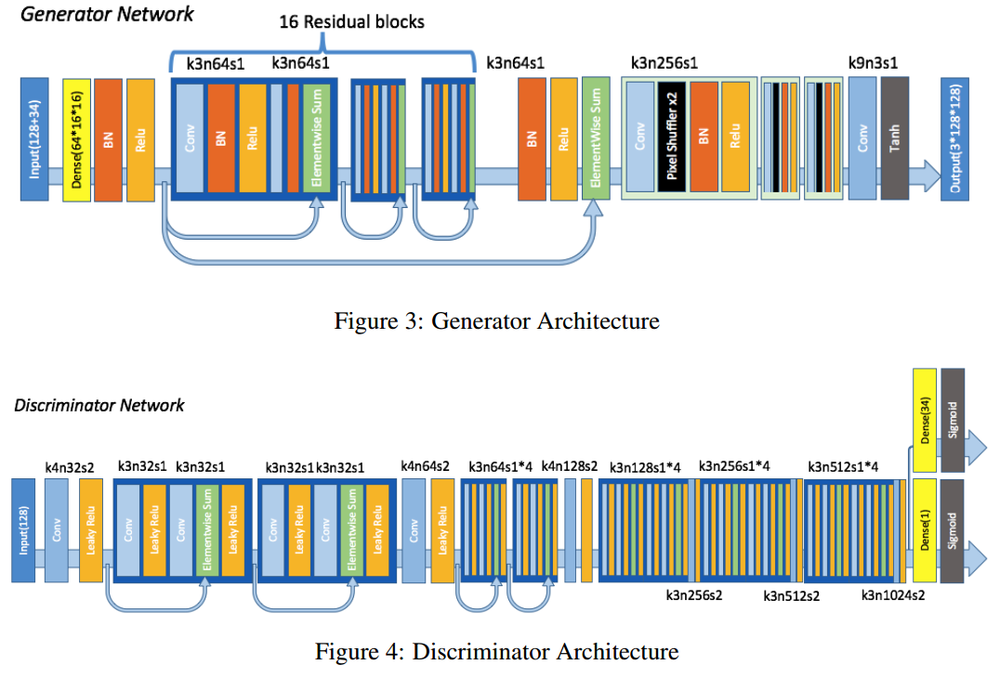

## Create Girls Moe
This repo contains a PyTorch from-scratch implementation of the paper [Towards the Automatic Anime Characters Creation with Generative Adversarial Networks](https://arxiv.org/pdf/1708.05509).

### What The Paper Did
Generating 二次元(にじげん) MOEst avatars...

generated avatars from the paper

### Environment
+ Python 3.6
+ Python-OpenCV 3.4.0
+ pyquery 1.2.4
+ i2v 1.0.0
+ PyTorch 0.4.0
+ GPU is better :-D
+ and so on.

### Attention
###### This is an unfinished repo. I'm training the models and completing the README.md under [*src*](src) >.<

### Networks' Structure
I want to call it a DRAGAN-like SRGAN structure because I use the gradient penalty as the paper told and two SRResNet as discriminator and generator.
The SRResNet(modified as the paper described) are like this:

**I have some modifications in this structure:**

1. I weighted label's loss and tag's loss with half of λadv beacause the loss described in the paper was so hard-core for me. (More details please refer in [*src/model/gan.py*](./src/model/gan.py))

2. Add a sigmoid operation in adversarial loss calculating since the results may more numerical stability.

3. Using Multi-Label Soft Margin Loss for tags' loss calculating.(Cross Entropy Loss may better because of the imbalance of the images' tag distribution. But I don't have too much time for weights tuning. :-D )

### Data Preparing
1. Crawled the images from the website as the paper proposed. Read the *readme* and *codes* in [*src/dataset/Spider/*](./src/dataset/Spider/*) to get more information.

2. I used the [lbpcascade_animeface](https://github.com/nagadomi/lbpcascade_animeface) model for face detecting. source codes are in [*src/dataset/FaceDetect/*](./src/dataset/FaceDetect/)

3. [illustration2vec](https://github.com/rezoo/illustration2vec) was used for face tagging. Please check the files in [*src/tag/*](./src/tag/)

### Generative Adversarial Network
1. The discriminator and generator were defined in [*src/model/networks/*](./src/model/networks/).
2. The training strategy of GAN was written in [*src/model/gan.py*](./src/model/gan.py).

### Tools for statistics
1. Currently I have some simple tools for face data statistics. More details in [*src/statistics/dataset/*](./src/statistics/dataset/).

### Super Resolution Processing
Coming soon.
