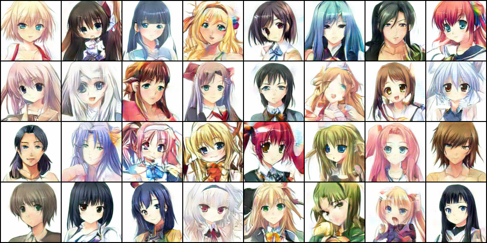

## Create Girls Moe
This repo contains a PyTorch from-scratch implementation of the paper [Towards the Automatic Anime Characters Creation with Generative Adversarial Networks](https://arxiv.org/pdf/1708.05509).

### What The Paper Did
Generating 二次元(にじげん) MOEst avatars...

generated avatars from my pre-trained model. Some avatars seem strange. I need to add some tricks and continue training it.

### Environment
+ Python 3.6
+ Python-OpenCV 3.4.0
+ pyquery 1.2.4
+ i2v 1.0.0
+ PyTorch 0.4.0
+ GPU is better :-D
+ and so on.

### Attention
###### This is an unfinished repo. I'm training the models and completing the README.md under [*src*](src) >.<
###### If you want to use this repo, I strongly recommand you to read codes carefully.

### Networks' Structure
I want to call it a DRAGAN-like SRGAN structure because I use the gradient penalty as the paper told and two SRResNet as discriminator and generator.
The SRResNet(modified as the paper described) are like this:

**I have some modifications in this structure:**

1. I weighted label's loss and tag's loss with half of *λ**adv* beacause the loss described in the paper was so hard-core for me. (More details please refer in [*src/model/gan.py*](./src/model/gan.py))

2. Remove the sigmoid operation in adversarial loss calculating since the results with sigmoid layer may cause some problems.

3. Using Multi-Label Soft Margin Loss for tags' loss calculating.(Cross Entropy Loss may better because of the imbalance of the images' tag distribution. But I don't have too much time for weights tuning. :-D )

### Data Preparing
0. Cause I built an extremely clean dataset for this task. I'm glad to share my data-Preparing method here.

1. Crawled the images from the website as the paper proposed. Read the *readme* and *codes* in [*src/dataset/Spider/*](./src/dataset/Spider/) to get more information.

2. I used the [lbpcascade_animeface](https://github.com/nagadomi/lbpcascade_animeface) model for face detecting. source codes are in [*src/dataset/FaceDetect/*](./src/dataset/FaceDetect/)

3. [illustration2vec](https://github.com/rezoo/illustration2vec) was used for face tagging. Please check the files in [*src/tag/*](./src/tag/)

4. Remove the invalid images manually.

### Generative Adversarial Network
1. The discriminator and generator were defined in [*src/model/networks/*](./src/model/networks/).
2. The training strategy of GAN was written in [*src/model/gan.py*](./src/model/gan.py).

### Tools for statistics
1. Currently I have some simple tools for face data statistics. More details in [*src/statistics/dataset/*](./src/statistics/dataset/).

### Super Resolution Processing
Coming soon.

<!-- ## 萌妹头像生成
由[@A-nony-mous](https://github.com/A-nony-mous)翻译自原文 
这份repo包括了一份以PyTorch实现的论文[Towards the Automatic Anime Characters Creation with Generative Adversarial Networks](https://arxiv.org/pdf/1708.05509)

### 论文探讨的内容
　　　　　Second grins  
生成二次元(にじげん)头像

论文生成的头像

### 环境需求
+ Python 3.6
+ Python-OpenCV 3.4.0
+ pyquery 1.2.4
+ i2v 1.0.0
+ PyTorch 0.4.0
+ 高明的GPU :-D
+ 诸如此类

### 不要说我们没有警告过你

###### 本repo仍未完成。作者正在 [*src*](src) 下训练模型的同时继续补README.md >.<
###### 如果你想用这份repo，作者建议你仔细阅读代码。

### 网络结构
作者想称之为类似DRAGAN的SRGAN结构，因为使用了论文所提及的gradient penalty并有两个SRResNet用以临界检查和生成。
所使用的SRResNet(已按论文提及的方式安排)如图所示：

**作者对原结构的客制化改动:**

1. 对label和tag的loss有1/2*λ**adv*的加权，因为原论文的loss对于作者来说过于硬核。 (请见 [*src/model/gan.py*](./src/model/gan.py))

2. 鉴于sigmoid layer生成的结果可能产生错误，移除了adversarial loss calculating中的sigmoid操作。

3. 为tags' loss calculating使用了Multi-Label Soft Margin Loss(Images' tag的分布并不均衡，所以Cross Entropy Loss可能有更好效果.但作者没有足够的时间去做权重调整。 :-D )

### 数据准备
0. 作者作为给这个项目准备了特别准确的数据集的工作者，有必要在这里分享一下数据准备的经验。

1. 按照论文建议在网页上爬取照片。请阅读[*src/dataset/Spider/*](./src/dataset/Spider/)处的*readme*和*codes*获取更多信息。

2. 头像识别使用[lbpcascade_animeface](https://github.com/nagadomi/lbpcascade_animeface)。请见[*src/dataset/FaceDetect/*](./src/dataset/FaceDetect/)

3. 头像分类使用[illustration2vec](https://github.com/rezoo/illustration2vec)。请见[*src/tag/*](./src/tag/)

4. 手动移除无效的图像。

### 生成式对抗网络(Generative Adversarial Network)
1. 临界检查和生成器定义于[*src/model/networks/*](./src/model/networks/)。
2. GAN的训练策略写于[*src/model/gan.py*](./src/model/gan.py)。

### 分析工具
1. 目前已有较简单的头像数据分析工具。更多细节请见[*src/statistics/dataset/*](./src/statistics/dataset/)

### 超分辨率化
已经在做了，进展非常顺利 -->
